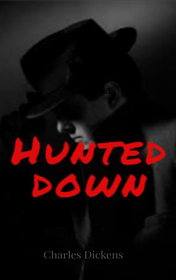

# Hunted down <kbd>v3.2.1</kbd>

  

## Creator
Charles Dickens

## Description
This is one of the detective stories of the famous English writer Charles Dickens. The main character is a smart and attentive man named Sampson. One day he sees a strange Mr. Julius Silton in his office. Sampson begins to suspect that this man is hiding something necessary from other people. This Mr. Silton appears in the life of the main character more often. Sampson understands that a crime is occurring and it must be stopped. Sampson turns into a real hunter of criminals. The writer once again demonstrates his talent: he perfectly describes the character and psychology of the people's behavior. Charles Dickens also gives a vivid imagery of the society of his time. The story is dynamic and the reader won't be bored.
