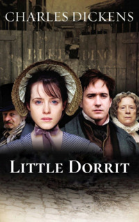

# Little Dorrit <kbd>v3.2.1</kbd>

  

## Creator
Charles Dickens

## Description
'Little Dorrit' is a novel by the English writer Charles Dickens. Dickens was a master in the realism style. When you read his novels, you believe the characters, empathize with their fates, as if these are real stories of friends or relatives. 'Little Dorrit' is no exception. This story is about the difficult life of the Dorrit family. The father of the family goes to a debtors' prison forever. His youngest daughter is born there. It seems that such life will definitely embitter the girl and teach her to survive without a sense of shame and honor. But she is an example of kindness and humility. No matter how difficult her life is, she always tries to help her family and support those who are in need. And one day a person appears in her life. This person wants to help her and her whole family... 
