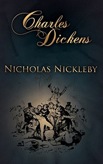

# Nicholas Nickleby <kbd>v3.3.1</kbd>

  

## Creator
Charles Dickens

## Description

A boy named Nicholas Nickleby was a happy carefree kid. Unfortunately, some time later his father passed away. After the tragedy Nicholas, his mother and sister went to London to ask their rich uncle Ralph Nickleby for help. The uncle sends Nicholas to a private school in Yorkshire. Nicholas discovers that this school is a terrible place. The pupil has to bear teachers' bullying until he meets a strange boy. His name is Smike. After many cruel punishments and endless hunger two inseparable friends decide to drop out of school. They manage to find a job in the theater. Many years pass filled with lots of exciting adventures. But later, when nothing can be changed, Nicholas finds out the awful truth about his best friend.  

