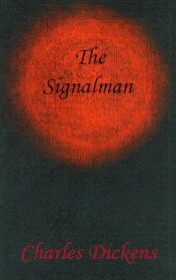

# The Signalman <kbd>v3.3.1</kbd>

  

## Creator
Charles Dickens

## Description

The railway signalman told me that his haunts by ghost. After each appearance of ghost a tragic event on the railway occurs. The signalman works in the booth that is located next to the entrance into the tunnel, it where he controls the movement of trains. When there is any danger, his colleagues signalmen alert him via telegraph and siren. Three times he gets ghostly signals of danger when his bell rings in such a way that only he can hear it. During each alert ghost appears, and then a horrible accident happens.

