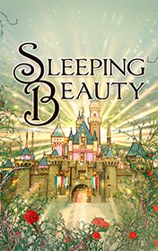

# Sleeping Beauty <kbd>v3.2.1</kbd>

  

## Creator
Charles Perrault

## Description

Luke Harrison and Jake Fulbright are directors and partners at a large real estate firm. They attend a board meeting and have a hard discussion about the company's development strategy. Luke wants to build housing for children, having in mind a positive, meaningful effort, while Jake prefers constructing office buildings in order to make bigger money. The two are good old friends, currently at the highest point of their career together. Luke is raising two children with his wife, but Jake's private life consists of little more than some bad habits. Something in their friendship goes wrong as Jake falls in love with his friend’s wife. Luke's suspicions make him feel uncomfortable in Jake's company. Jake views himself as a natural winner and plans to take all from Luke, not only business-wise…

