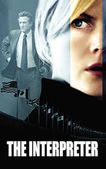

# The Interpreter <kbd>v3.2.1</kbd>

  

## Creator
Charles Randolph

## Description
Dictators must be overthrown with words, and not pistols. This way is slower but more reliable. Otherwise, there is a big chance that everything will happen again and the country will be involved into a war. Only the interpreter can know the true value and strength of the right words. Sylvia Broome works as an interpreter at the UN headquarter. She is just a tiny cog in one complex mechanism. Her work is very important, as the leaders of the different countries have to find a common language with each other. Suddenly Sylvia finds out about the preparation of a murder. The Matobo President is to be a victim. Then agent Keller appears in her life. He is in charge of investigating the case. The agent does not trust Sylvia as some details from her dark past are constantly coming out. Still he is devoted to his work and strives to protect the interpreter. It is not his duty unlike the foreign leaders' protection. But is this interpreter so defenseless as it seems?
