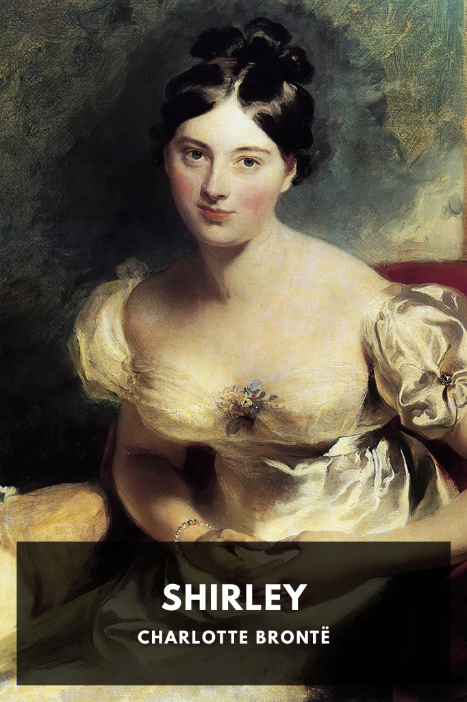

# Shirley <kbd>v3.3.1</kbd>

  

## Creator
Charlotte Brontë

## Description
In the early part of the 19th Century, two young women struggle in different ways for independence and love during turbulent times caused by the advent of mechanical looms in the textile industry.
