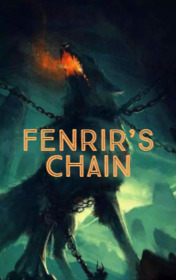

# Fenrir's Chain <kbd>v3.2.1</kbd>

  

## Creator
Chris Rose

## Description
As the god of cunning and deception, Loki was very intelligent and treacherous. He had three children from different mothers. Jormungand was a giant snake that slept on the ocean floor, covering the whole earth with his rings. Hel was a girl whose one half of the face looked beautiful, and the second half was terrible, like death itself. Fenrir was a huge wolf. God Tyr loved to play with him when Fenrir was a cub. But he grew and became bigger and stronger. The gods realized that Fenrir was too dangerous and could kill all of them. They decided to tie the wolf so that he could not harm anyone. But which chain on earth would be able to hold such a monster? The gods went to the dwarves who made the hammer of Thor and lots of other incredible things.
