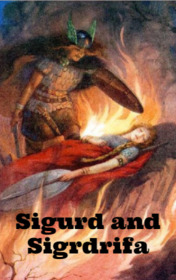

# Sigurd and Sigrdrifa <kbd>v3.3.1</kbd>

  

## Creator
Chris Rose

## Description
In some distant northern lands there was a mountain, the top of which was hidden in a big ring of hot flames. The fire was so strong that the top could not be seen from the ground. One day a mighty and fearless warrior was riding a horse near this mountain. It was Sigurd. Certainly he became interested in this bright fire. The warrior immediately drove to the top. The horse was frightened, but Sigurd kept riding. When he got to the ring of flame, he realized that he needed to cross it to find out what was next. The horse submitted to its owner and jumped through the firewall. The flame was left behind and Sigurd saw a palace on the top of the mountain. It was a real mystery. He felt that he could not leave without learning what was inside.
