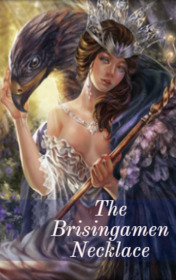

# The Brisingamen Necklace <kbd>v3.3.1</kbd>

  

## Creator
Chris Rose

## Description
Freya was the most beautiful out of all the gods and goddesses in Asgrad. She was tall and stately with long blond hair and bright blue eyes. She was a good woman. Still Freya had one fault - greed. She loved not food or weapon, but adored jewelry: pearls, gold, precious stones, rings and necklaces. The goddess had a lot of jewels. Despite this, she always wanted more. Her wish for these precious things turned into an obsession. She had the largest collection in Asgard. But those jewels from other worlds were an enormous temptation for her. Freya loved travelling to Midgard in search of countless new bracelets and necklaces. One day, Loki put on his cloak that made him invisible and followed the goddess to play another joke on her.
