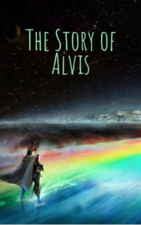

# The Story of Alvis <kbd>v3.2.1</kbd>

  

## Creator
Chris Rose

## Description
Alvis was a dark elf. People did not like his folk. They believed that all the existing elves were greedy and unfriendly. But Alvis decided to change everything. He told many other elves they were as good as other people. He was going to prove it and marry the daughter of Thor. Of course, everyone was laughing at him. No one believed that an elf could come to terms with the formidable and powerful God of Thunder. Alvis waited for the night and crept over the Rainbow Bridge to Asgard. Soon he met a big and strong man with a red beard in the clothes of a farmer. He got into conversation with this man and said that he wanted to marry Thor's daughter. Elvis was convinced that the farmer could not be a god. He did not know that it was Thor himself.
