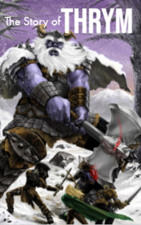

# The Story of Thrym <kbd>v3.3.1</kbd>

  

## Creator
Chris Rose

## Description
Once Thor woke up in his bedroom and did not find his hammer. Every day he would wake up and first of all take Mjolnir into his hands. This hammer helped him invoke thunder and lightning. It was even able to make Thor stronger than one hundred warriors. With the hammer the God of Thunder could defeat any rival. He fought the formidable giants, but no one could stop him when Thor was holding his hammer. But that strange morning there was no faithful weapon in the bedroom. Thor called Loki. He realized that when unpleasant or strange things happened - the God of liars had definitely something to do with it. Loki insisted that he knew nothing about the missing hammer. And this time he did not lie. Loki offered his help and the gods soon found out who had stolen the great weapon.
