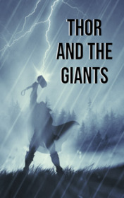

# Thor and the Giants <kbd>v3.3.1</kbd>

  

## Creator
Chris Rose

## Description
It was a quiet and sunny day in the early summer. Thor and Loki were strolling around Asgard. Thor was bored. Thor did not like to rest and laze, he adored only one thing - fighting with the giants. He told Loki about that. Loki tried to convince Thor that Asgard was the most beautiful place in the universe and it was a great opportunity just to relax and enjoy the views. All his words were for nothing. Thor was not very interested. He was ready to harness the goats into the cart and fly to fight with the giants. His soul demanded something militant. After all, the giants themselves could appear in the land of Gods at any time and cause a lot of problems. Loki was not too convincing and he had to go on this dangerous journey with Thor.
