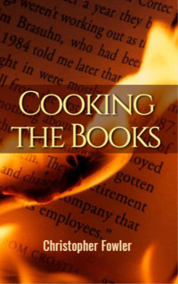

# Cooking the Books <kbd>v3.2.1</kbd>

  

## Creator
Christopher Fowler

## Description
Haldeman left the office on Friday evening. He walked through the restaurant and went down to the garage. He got into the car. On the way home the man looked at himself at the car mirror. What he saw disturbed him. The face looked unhealthy, although forty-eight is still not too old. He was sweating. He was very thin and most of the shirts were too loose for him. Even the wedding ring got too big. Haldeman still wore it, although he had no wife anymore. This period was very difficult for him. Haldeman was preparing for bankruptcy. But he had an idea for how to get a lot of money and get away with it. He was already determined to set fire to his restaurant and get insurance. The idea was perfect. What could go wrong? 
