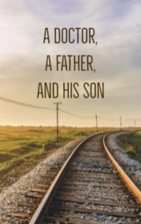

# A Doctor, a Father, and His Son <kbd>v3.3.1</kbd>

  

## Creator
Clare Gray

## Description
People can be courageous even in the most difficult times. The protagonist of this story also proves that he has great power. It was a warm August morning. Kenzaburo Oe got off the train. At such an early time, the city was still sleeping. Everything was unusually quiet. On a similar quiet August day, something fatal happened. The first American plane flew over Hiroshima and dropped a lethal bomb. It changed the familiar world forever. Lot of people say that this historical moment brought World War II to the long-awaited end. And it even saved hundreds of thousands of lives. But this bomb killed dozens of thousands of civilians. Even today, after sixty years, humanity feels the consequences of that awful tragedy.
