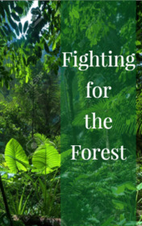

# Fighting for the Forest <kbd>v3.2.1</kbd>

  

## Creator
Clare Gray

## Description
Chico was well aware that the forest should be investigated carefully. So cautiously as the people of the forest did many years ago. The Amazon Forest is one of the most wonderful places on the planet. It is big, old and there are many animals and plants including rare species. Here is the larger part of the fresh water reserves  on the planet. Chico was born in Brazil. There were no schools in the tropics, and he began to work hard at the age of ten. He did the same thing as the others. Everybody collected useful materials in the forest and sold them in the city. As a child, the boy did not think about the world outside the forest. But when he grew up, he realized, that the Earth is much larger than his beautiful tropical forest.
