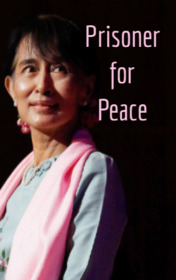

# Prisoner for Peace <kbd>v3.3.1</kbd>

  

## Creator
Clare Gray

## Description
Aung San Su was born in Burma in a rich respected family. Su's father was killed when the girl was only two years old. But despite this, her childhood was happy. When the girl was fifteen, the whole family mo moved to India. Su was a very smart girl and became interested in politics. This occupation was very easy for her. She got into Oxford, where she met one Englishman. It turned out to be her destiny. Later the couple married. Su and her husband lived happily, but Su did not forget her father. She remembered that he died for his country - Burma. Aung San Su did not choose the simple life of a quiet and inconspicuous housewife. Her youthful interest in politics was not in vain. It changed her life. And also other people's lives.
