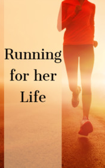

# Running for Her Life <kbd>v3.3.1</kbd>

  

## Creator
Clare Gray

## Description
Ana was born in the east of Cuba, in a small unremarkable town. She was a cheerful child and loved  running from early childhood. Sport was important not only for her, but also for her family. The Cuban government was interested in good doctors, smart teachers and strong athletes. At the age of ten, Ana became a good runner. She won most of the competitions in running, some of them -  barefoot. The girl was training every day. She worked hard and waited for that moment, when someone would notice her. In the end, she succeeded - the girl was invited to one sports school. Other children were tall and strong, and the girl herself began to lose speed. She was getting heavier and slower. But soon Ana met a man who helped her regain motivation. She obtained a new life goal.
