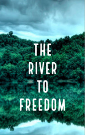

# The River to Freedom <kbd>v3.2.1</kbd>

  

## Creator
Clare Gray

## Description
It was a quiet calm evening. Matthew was at home with his father. Suddenly some soldiers  appeared: they killed the father. Matthew in despair took the weapon. He tried to shoot them, but was caught and taken to the army. Matthew ran away, even though it was not easy. He hid in the river. He lurked, listening to the voices of his enemies and hoping that he would not be noticed. But suddenly the fugitive saw a crocodile. The dangerous predator headed towards the young man. Weirdly, this crocodile changed its mind and swam away. The guy was very close to death, but it turned out to be his lucky day. Today Matthew lives in Bulgaria. He is known as a tall, strong man with many friends. But in his eyes one can see some kind of another secret force.
