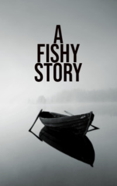

# A Fishy Story <kbd>v3.2.1</kbd>

  

## Creator
Clare West

## Description
The most experienced fishermen know that the best place for fishing is the west of Ireland. There are rivers full of salmon. Sinclair spends three days there, trying to catch a fish, but he is unlucky. The young man goes home. He decides to go by train, and in the twentieth century such a trip seems like a real adventure. At the station, where he has to wait for the train, there is a lot of smoke - but there is not enough heat. The man is cold. He has wet shoes after fishing. He hoped that at the station he could warm up - but he continues to freeze. The station manager lets the guy into his office. It is warm and there is steam from the clothes. They talk about fishing and politics. Sinclair admits that he failed to catch anything. Soon the train arrives. The guy goes to the cold again. A little rain starts on the street.
