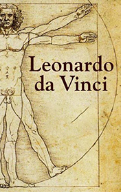

# Leonardo Da Vinci <kbd>v3.2.1</kbd>

  

## Creator
Clarke Georgia

## Description
Leonardo da Vinci is a man who was more than for hundred years ahead of his time. He achieved a stunning success in various areas. He was a writer, an inventor, a musician and an artist. But he considered himself a scientist. He was the first who understood the human anatomy. Leonardo da Vinci is the clearest example of the universal man. He is primarily known as an artist and the greatest representative of High Renaissance art. He was born in the 15th century and created a drawing of the aircraft. People began to fly only a century later. Leonardo proposed a project of an ideal city with the sewerage system, but the Duke of Milan rejected his project. Several centuries later, the project was recognized as a perfect basis for the construction of the city. Even nowadays Leonardo da Vinci remains one of the most mysterious and brilliant people of the second millennium.
