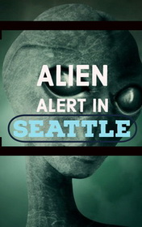

# Alien Alert in Seattle <kbd>v3.2.1</kbd>

  

## Creator
Clemen D. B. Gina

## Description
This is the mountain range called Cascade. It is located in the county seat of Seatal, Washington. At first glance, this is an extremely inappropriate place for an alien spacecraft to appear. But once a mysterious flying object is seen by the locals. No one believes in such nonsense. Aliens from another planet are in the United States? It is more like a cheap science fiction movie! Still the residents are excited by this news. Later the trinity of good inseparable friends and classmates - Barbara, Karen and Walter notice that one of the teachers in their high school is starting behaving extremely strange. Young,  but extremely smart guys begin an independent investigation and soon they discover a very unexpected truth.
