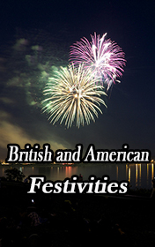

# British and American Festivities <kbd>v3.3.1</kbd>

  

## Creator
Clemen D. B. Gina

## Description
How much do you know about the festivities of the United States of America and Great Britain? Why do people celebrate Halloween? Did you know that this is the Celtic day of the dead, and at this time people were waiting for the arrival of good and evil spirits in the world of the alives? Scary costumes and make-up are needed in order for the evil spirit to take you for one of the monsters. Who was the person that invented Christmas cards? Why are they so popular nowadays in most countries of the world? And what about the most romantic holiday on the whole planet? Is Valentine's Day a project of good marketers or a festivity with a long respectful history and deep roots? This book will give interesting answers to most of your questions.
