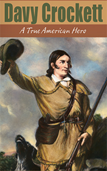

# Davy Crockett <kbd>v3.3.1</kbd>

  

## Creator
Clemen D. B. Gina

## Description
Davy Crockett is a legendary personality for the United States of America. This is the first hero of this country, who lived when America just came into existence. Davy proved himself to be an excellent scout, hunter and politician. Davy refused the opportunity to build a brilliant career in the Congress and went to Texas. There he helped Americans: men and women. He became the hero of the Alamo. The courage and strong spirit of this amazing officer changed the history of the country. Davy died, defending the fortress in Alamo. It happened during the War for Independence of Texas. Nowadays you can find a lot of books and movies about this man. Even our children can learn more about the great person thanks to the fascinating book.
