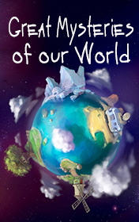

# Great Mysteries of Our World <kbd>v3.3.1</kbd>

  

## Creator
Clemen D. B. Gina

## Description

People live and die. A day changes a night. This is the law of life. We have a brain and use logic for understanding life and further development. That is why we live in the age of the progress. Science can explain everything or almost everything. But still there are some unsolved things, which happened in different parts of Earth and at various times. This book consists of eight parts. Each part describes unexplainable things from real life. Real people ran across something mysterious and supernatural. Some of these stories have a tragic end, but humanity can't find a logical explanation. You'll read about the theories and different points of view of the great scientists. Maybe you will be able to find your own answers. 

