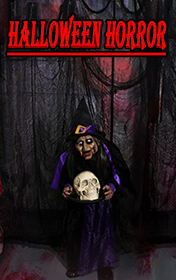

# Halloween Horror <kbd>v3.2.1</kbd>

  

## Creator
Clemen D. B. Gina

## Description
The story is set in Salem, Massachusetts. The town is known for the witch hangings in 1692. That's why it's often called the 'Witch City'. Megan and Kelly have recently moved here with their parents. Now it is late October and Halloween is approaching. Megan, Kelly and their classmates are very excited. They prepare costumes and decorations. Then they look for a place to celebrate. The children decide to visit one of the Salem Witch Museums for inspiration. In the museum something strange happens. Megan sees a scary old lady, even though the museum attendant assures her that the children are the only visitors. In the end the friends find an abandoned house near the cemetery and decide to have a Halloween party there. But the party turns out to be much scarier than they could ever imagine.
