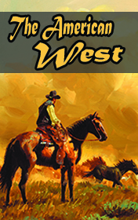

# The American West <kbd>v3.2.1</kbd>

  

## Creator
Clemen D. B. Gina

## Description
How did the history of America begin? Did it start from the settlers who came to the Indian tribes? No, everything started much earlier. The Indians arrived from another land about 40 000 years ago! They crossed  the sea and settled in America. The contacts with more civilized nations brought Indians weapons, new knowledge about agriculture and a lot of dangerous diseases from which the entire tribes died. Immerse yourself in this interesting time and learn more than can be seen in the films about the Wild West. In reality, everything was much more complicated. Find out the names of the most famous Indian leaders and ancient explorers, learn more about the key moments that have changed the history of the whole world.
