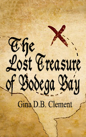

# The Lost Treasure of Bodega Bay <kbd>v3.2.1</kbd>

  

## Creator
Clemen D. B. Gina

## Description

It's so great when our parents travel due to their work and take you to the unusual places. There are many interesting and useful things you can discover. Last time, for instance, the captain of a Spanish pirate ship wanted to turn the children's parents into his slaves. Only fortune helped them to escape this fate. The children were even able to steal a treasure map from the pirates-ghosts. And now the adventures are waiting for them on summer holidays. The parents take the children to Bodega Bay - a small town with the marine reserve. It is located on the northern coast of San Francisco. Except the rare species of animals, this place is also famous of its history. Long time ago it was a pirates' secret place. With the map the children will be able to find the hidden treasures. However, the map is too difficult to read and they have only one week to explore the coast.

