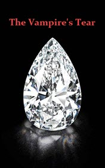

# The Vampire's Tear <kbd>v3.2.1</kbd>

  

## Creator
Clemen D. B. Gina

## Description
A young boy Nick finds a summer job in one of the museums in new York. He decides to invite his two best friends. Bill and Michelle are brothers. They gladly accept the invitation. At this time, there is an exhibition with one of the most expensive and rarest diamonds called Vampire Tear in the museum. At night, the diamond disappears and the security guard is killed under mysterious circumstances. People begin to believe that a vampire committed everything. All the citizens start panicking. They say the vampire wanders in search of another victim every night. The police have no evidence. In addition, three brave teenagers decide to initiate an investigation. They already have an access to the crime scene. This summer will be an unforgettable experience for them. They are going to make a terrible discovery.
