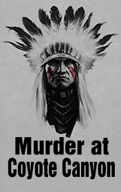

# Murder at Coyote Canyon <kbd>v3.3.1</kbd>

  

## Creator
Clemen Gina D. B.

## Description

One family moved from Florida to California. They were going to live in a small town Portola Point. This town is named after the Spanish explorer. In the 18th century, he supplanted the native inhabitants Chumash from the territories. Now the Chumash live in the reservation near Portola Point. The family had been living in the town for 3 months. Everything was fine. The children's friend from Florida came to them for the summer holidays. One day the children were playing in the yard. Suddenly they felt land shaking. It was an earthquake. The earthquakes had been happening for the last months. Everybody was worried. The next day on the 4th of July, during the parade, a shaman of Chumash came to the citizens. He told them that they had to stop the building on the ancient cemetery in Coyote Canyon. Otherwise, they would regret very much. The disasters were coming...

