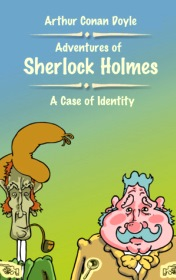

# A Case Of Identity <kbd>v3.3.1</kbd>

  

## Creator
Conan Doyle

## Description
During Sherlock Holmes and Dr. Watson the conversation, Mary Sutherland comes. She says her story. Her father died, and now she lives with her mother and stepfather, not much older than she is. Mary inherited the small capital from his uncle, that she receives by small parts every year. This money she gives to family and earning for living herself by typing. Since Mary's father was a plumber, every year they receive the invitation to the plumbers' ball. Step-father does not allow Mary to go to the ball. But one year he is gone to France, she goes to the ball, where she met with Mr. Hosmer Angel and fell in love with him.
