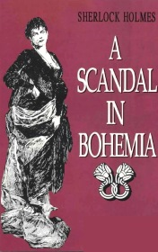

# A Scandal In Bohemia <kbd>v3.2.1</kbd>

  

## Creator
Conan Doyle

## Description
While the Dr. Watson got married and engaged in private medical practice, to Sherlock Holmes for help addressed German aristocrat who conceal their origin from the detective. But Holmes wasn't difficult to immediately expose him. Count Von Kramm's problem was that he was going to marry, and the woman with whom he had a love affair before, blackmailed him. She was charming opera singer and had a photo where they were together with him. The King's agents have tried to searched photo, but couldn't find. All hope of Sherlock Holmes, otherwise the wedding  will be able to fail. To carry out the task will have to be reincarnated as a  groom for penetrate into the house of blackmailer.
