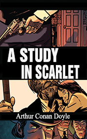

# A Study in Scarlet <kbd>v3.2.1</kbd>

  

## Creator
Conan Doyle

## Description

This book is a debut of Sherlock Holmes and his companion Dr. Watson. The novel marked the beginning of a new epoch in the crime genre and the world literature in general. In 1881 two gentlemen settled in the same apartment in London. One of them is a retired military surgeon named John H. Watson. We will learn this story from his memoirs. His neighbor is a private detective Sherlock Holmes who was wounded during the war. The detective makes Dr. Watson amazed by his knowledge and by his original methods of solving the crimes. Sherlock complains about the absence of the real criminals in London. It's the reason why he can't use his methods in practice. But suddenly he got a lucky opportunity from Scotland Yard. His friend who works there, told him about a strange murder committed in an empty house.

