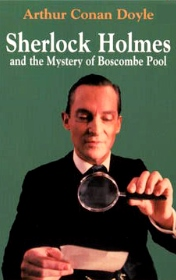

# Sherlock Holmes and the Mystery of Boscombe Pool <kbd>v3.3.1</kbd>

  

## Creator
Conan Doyle

## Description

Holmes had been informed about next murder in Herefordshire and went to Boscombe Valley in that community. Mr. Charles McCarthy had been killed by his own son. At least son was the prime suspect because all evidences were leading to him. But James was denying a charge. He told that accidentally met his father in the wood that day and they quarreled. The quarrel was because of son’s fiancée. Mr. Charles chased away his son. When James had gone out not far from that place he heard a scream and ran back. McCarthy had been killed and his last word was “a rat”. Nearby of Mr. Charles’s body was laying a cloak, but that thing had disappeared later and James noted it.

