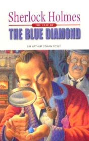

# The Adventure of the Blue Carbuncle <kbd>v3.3.1</kbd>

  

## Creator
Conan Doyle

## Description
Once in London on Christmas Eve at the hotel has committed a larceny. Countess of Morcar has been stolen a precious diamond which was called Blue Carbuncle. It was one of the most expensive gems in the world. Suspicions has fallen on John Horner he has been working at the hotel as a plumber. He was imprisoned for robbery because previously he had served out in prison for the same crime. Plumber to denied a charge but nobody believed him. At the same time on one of the streets of London ruffians attacked the man. Nearly of that place was walking a commissionaire Peterson and like an honest person he had decided help that man and to defended against of them. The attacked man had run away and dropped the goose which he carried with him. Peterson took the goose home to eat the bird and his wife had pulled out of it a diamond. This diamond the honest man Peterson had brought to Holmes.
