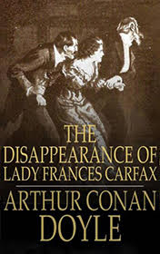

# The Disappearance of Lady Frances Carfax <kbd>v3.3.1</kbd>

  

## Creator
Conan Doyle

## Description
This is one of the stories of the English writer about the well-known detective Sherlock Holmes. One elderly governess seeks help from him. She asks Mr. Holmes to find her ward Lady Frances. Every two weeks the governess used to get letters from Lady Frances Carfax. But she got no letters for the last five weeks. The fortune of Lady Frances is modest. Still she inherited some rarest jewels. She always carries them with her. Sherlock Holmes is very busy so he lets his best friend Dr. Watson investigate this case. The doctor goes to Switzerland. He arrives at the hotel where Lady Frances usually stops at. Dr. Watson does not find her. Watson finds out that she had suddenly left in an unknown direction. Before that, a man with a beard visited Lady Frances. The truth is that this stranger haunted her.
