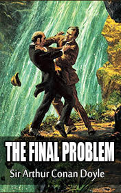

# The Final Problem <kbd>v3.3.1</kbd>

  

## Creator
Conan Doyle

## Description
Holmes worked for the French government so Dr. Watson saw less and less of his friend. One fine evening Sherlock Holmes managed to visit his precious friend. Holmes told Watson about one criminal world genius, who created a powerful criminal network throughout London. It was James Moriarty, a famous professor from London. It was a gifted man with phenomenal mathematical abilities. An insidious teacher developed criminal schemes but no one could prove the guilt of this clever mathematician. Sherlock Holmes firmly decided to end the monstrous plans of Moriarty. In response, the professor threatened his rival. In case of his death, Moriarty promised to take Holmes with him. The detective strongly refused to back off.
