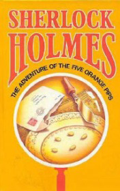

# The Five Orange Pips <kbd>v3.2.1</kbd>

  

## Creator
Conan Doyle

## Description
Colonel Elias Openshaw has been a large planter in the South of U.S. But he returned at motherland, to England after war. Elias used to be brave and determined, but he become horrified, when received an envelope with letters "K.K.K." on it, and inside was nothing but the five orange pips. Fourteen mounth later the exact same letter was send tohis brother Joseph. Five days after that he died falling down from the hill and breaking his head. Almost two years left and now letter with five pips received John Openshaw the Joseph's fater.
