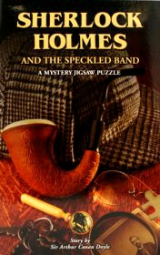

# The Speckled Band <kbd>v3.2.1</kbd>

  

## Creator
Conan Doyle

## Description
A girl named Helen Stoner asked Sherlock Holmes  for help. She lived in an old estate near the village, along with her stepfather Dr. Grimesby Roylott who used to be a doctor when he lived in India. Two years ago she lost her sister Julia. She died two weeks before her wedding, under mysterious circumstances. Before his death, for several nights in the house she heard a strange whistling that very frightened her. The night Julie died, Helen had heard similar sounds. On her deathbed, Julia shouted : "It was a speckled band !"  Now Helen temporarily moved to her sister's room because her one is being repaired. At the first night Helen heard a strange whistling again and panicked.
