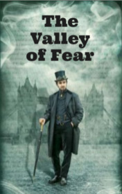

# The Valley of Fear <kbd>v3.3.1</kbd>

  

## Creator
Conan Doyle

## Description
This is the last story from a successful series of books about a well-known detective. This story is partially based on real events. It tells about another day in the life of Sherlock Holmes. Once he received an unusual letter with a cipher. It turned out that it was sent by one of the henchmen of the worst enemy of the detective - Professor Moriarty. This letter said that an assassination attempt was being prepared on a Mr. Douglas. Immediately after this, the policeman came to Sherlock's house. He said Mr. Douglas was murdered recently. Sherlock Holmes considered it to be an interesting case and decided to investigate it. Soon he came to an unusual conclusion: Mr. Douglas survived. In the house they found the body of the killer, who did not cope with the task.
