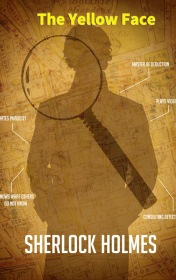

# The Yellow Face <kbd>v3.3.1</kbd>

  

## Creator
Conan Doyle

## Description
It happed in spring when Sherlock was walking in the park with his friend Dr. Watson. Sherlock Holmes suffered from tedium without work. At that time at Sherlock's house had come strange guest and forget his pipe. Returned home and looked at this thing, Holmes described this person exactly he was. His strange visitor was Mr. Grant Munro, he was a merchant of tobacco. Once his wife Effie went out, and returned very pale and panted. Munro didn't know what Effie did at the highway at 3 a.m. He asked Holms to looked into this case because thought that his wife deceived him. She had been from America and had a husband and a daughter. But they had died.
