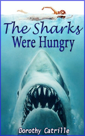

# The Sharcks Were Hungry <kbd>v3.3.1</kbd>

  

## Creator
D. Catrille

## Description
It was a good day. John decided that now he could definitely go home. It was the best day in recent years for Dr. Perry. He was extremely pleased. John's bag was filled with a huge variety of seashells. There was enough material to study for months. John took his bag and sat on the reef that connected the mainland with the island. The man wanted to watch the sunset. It was a very beautiful sight, which was worth a few valuable minutes. After that he went to the shore. It was quickly becoming dark around, and John went faster. The next minute he fell. There was water all around. It covered him over his head. He could not understand where he was and what was happening. It was difficult, but John finally managed to climb onto the sand.
