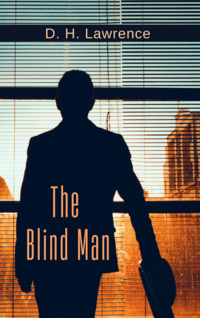

# The Blind Man <kbd>v3.3.1</kbd>

  

## Creator
D. H. Lawrence

## Description
Isabel Pervin sat in the house. She was listening to two sounds: to the noise of cars outside the window and to her husband's footsteps in the hall. They were once a happy couple. But this happiness disappeared. Her husband had been blinded in the war in France. He was totally blind. Isabel did everything to help him but sometimes her husband was obnoxious. She was going to have a baby. Isabel was happy. But she was also worried. The woman decided to give all her love and attention to her future child. But what about her husband? But something made Isabel happy - her old friend Bertie wrote to her. Bertie was like a brother to her, even closer than her own brothers. And now she was waiting for him to arrive. But her husband and Bertie didn't love each other. Isabel couldn't imagine how this meeting would happen. 
