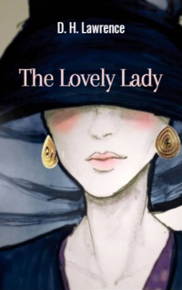

# The Lovely Lady <kbd>v3.3.1</kbd>

  

## Creator
D. H. Lawrence

## Description
Pauline was an old woman. She turned seventy-two. But she looked much better at her age. And under a particularly successful light she could be taken for a young woman of thirty. She had beautiful features and a good figure. Only big sad eyes gave out this age. She left her husband many years ago. Pauline lived with her son Robert in a big house in the suburbs of London. Pauline's niece named Siss lived together with them. The girl was young and very modest. The three of them often had dinner by candlelight. Pauline loved candles, because by their light she looked especially young and beautiful. After that, they usually drank coffee in a cozy living room. There were a lot of expensive furniture and beautiful paintings. Pauline felt happy at such moments. 
