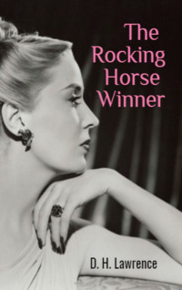

# The Rocking Horse Winner <kbd>v3.2.1</kbd>

  

## Creator
D. H. Lawrence

## Description
Hester was a beautiful woman from a very rich and powerful family. Soon the woman fell in love and got married. But she was not happy in marriage. It turned out to be rather boring. She gave birth to three children, but even that did not change anything. Two daughters and a son were smart and healthy children. Still Hester did not truly love them. Though she tried to act like a good mother. Her husband worked in the office. Every morning he left for work. But the man was not doing very well - the family was not very rich. They lived in a large beautiful house with expensive furniture. Around the house there was a nice green garden. One day, their son asked Hester why they didn't have their own car. Hester replied that the reason was the boy's father was not very lucky in life.
