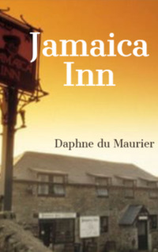

# Jamaica Inn <kbd>v3.2.1</kbd>

  

## Creator
Daphne du Maurier

## Description
Mary Yellan is 23 years old. After her mother's death the girl goes to live with her aunt Patience Merlyn. Her husband Joss Merlyn is the landlord of Jamaica Inn. On the way there Mary learns strange stories about this place. They say people never stay at Jamaica Inn because they are afraid. When the girl finally arrives at her destination, she is impressed by the lonely and gloomy building. She can hardly recognize her aunt. Patience used to be very cheerful. But now this woman seems to be sad and frightened. She looks much older than she really is. There are no guests at the inn in the daytime. However, on Saturday nights it is full of suspicious visitors. Mary understands that something ominous is happening. Whatever it is, she wants to put an end to it.
