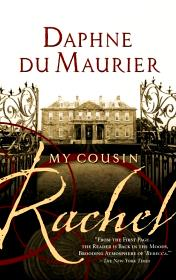

# My Cousin Rachel <kbd>v3.3.1</kbd>

  

## Creator
Daphne Du Maurier

## Description

While guardian to orphaned cousin Philip was travelling through Italy, he met and married a woman named Rachel who was a Philip's cousin. Sometime later guardian had died from a strange illness. And the cousin Rachel wanted to return all possessions of her late husband to Phillip and had stayed live with him.
The protagonist Philip fell in love with his cousin Rachel and didn't want to see of any evidences of her complicity in murder of his guardian. After he made a rich present for the Rachel, Philip suddenly fell ill.

