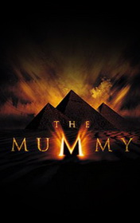

# The Mummy <kbd>v3.3.1</kbd>

  

## Creator
David Levithan

## Description

Dramatic events of this story took place three thousand years ago in city of Thebes. All this had happened when a pharaoh Sati had been murdered. His woman has betrayed him with his High Priest of the Dead named Imhotep. The pharaoh had caught the lovers, so Anck-su-namun was afraid that he could kill them both. So she decided to kill him first, so she has knifed him with Imhotep's help. When they heard Sati's guards were coming, Anck-su-namun pushed the knife into her own stomach and said to Imhotep to bring her back to life later. She knew that he could do it. Woman was dying with thought that her man would do everything to see her again. Who knows how much strong he tried to revive her but it wasn't enough…

