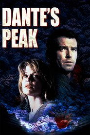

# Dante's Peak <kbd>v3.3.1</kbd>

  

## Creator
Dewey Gram

## Description

This is a catastrophe book with a very dynamic plot, which will keep you in suspense till the very end. The events take place in the city, which is situated near the volcano Dante`s Peak. The city has always been considered as one of the most safe and picturesque places. At least, the young mayor assured everybody in this. However, when Harry Dalton came to this city, she had to doubt about it. Harry Dalton is an experienced scientist-volcanologist. He lost his wife during the volcanic eruption. Nowadays volcanoes are his routine work. Harry Dalton came to this city with one aim – studying of the seismic activity. Gradually he finds the signs of the future volcanic eruption. It may lead to the end to the world. Unfortunately, nobody wants to listen to him…

