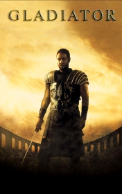

# Gladiator <kbd>v3.2.1</kbd>

  

## Creator
Dewey Gram

## Description

General Maximus, the Commander of the Roman Army of the North, has won his last battle in the war against Germania. Then, he had hoped to return to his farm and his family in Spain. But there were many serious problems in Rome and Emperor Marcus Aurclius had known that he would soon die. Maximus realized that he might perform another duty for the Emperor before he could back home. He knew that it would not be easy, and he was right. Soon he has lightened for his life again, at first as a prisoner, then as a slave, and finally as a gladiator. One thought had been kept Maximus alive: that he would finally meet and kill the man he had hated the most - the new Emperor, Commodus.

